# [Tarea 09] Ejercicios Unidad 04-A-B | Eliminación gaussiana vs Gauss-Jordan

## CONJUNTO DE EJERCICIOS

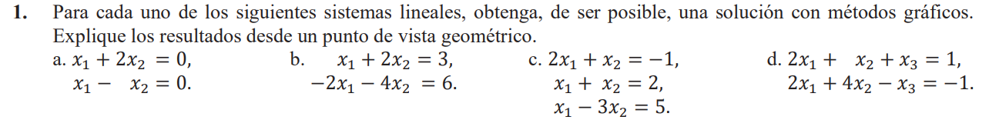
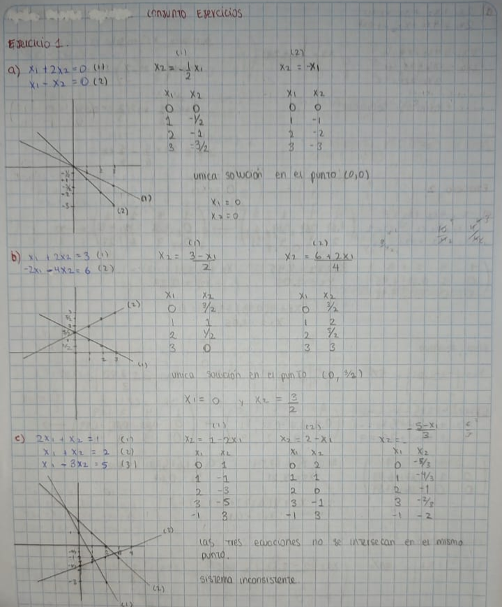
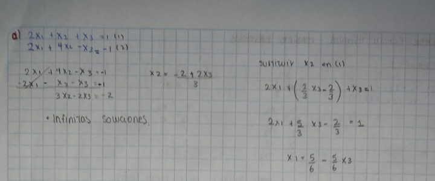
---
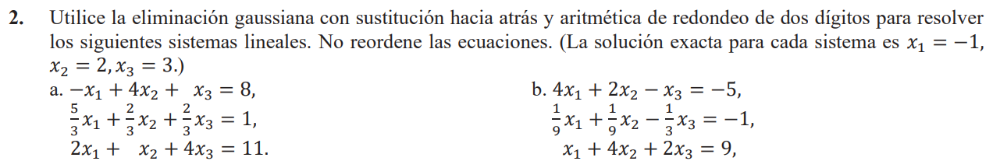

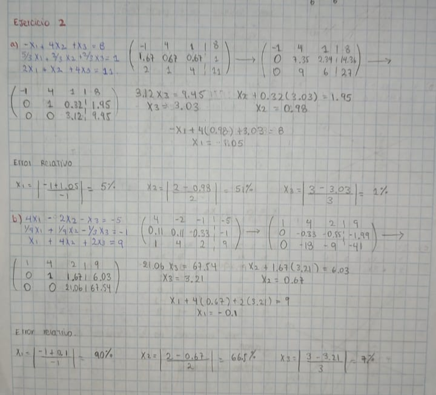
---
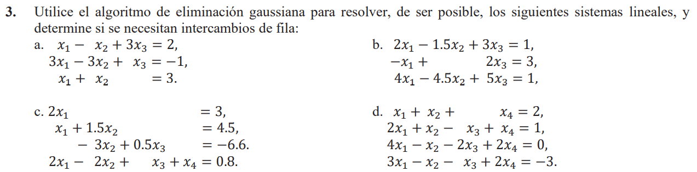
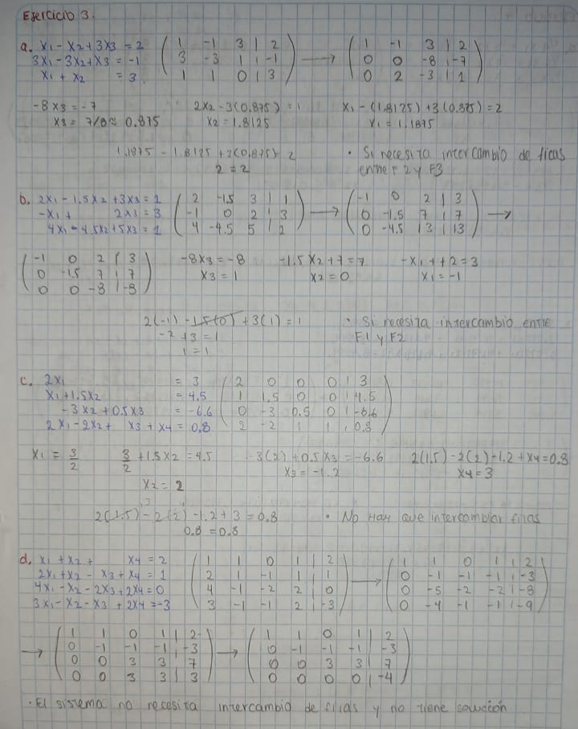
---
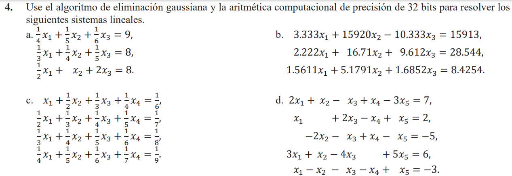
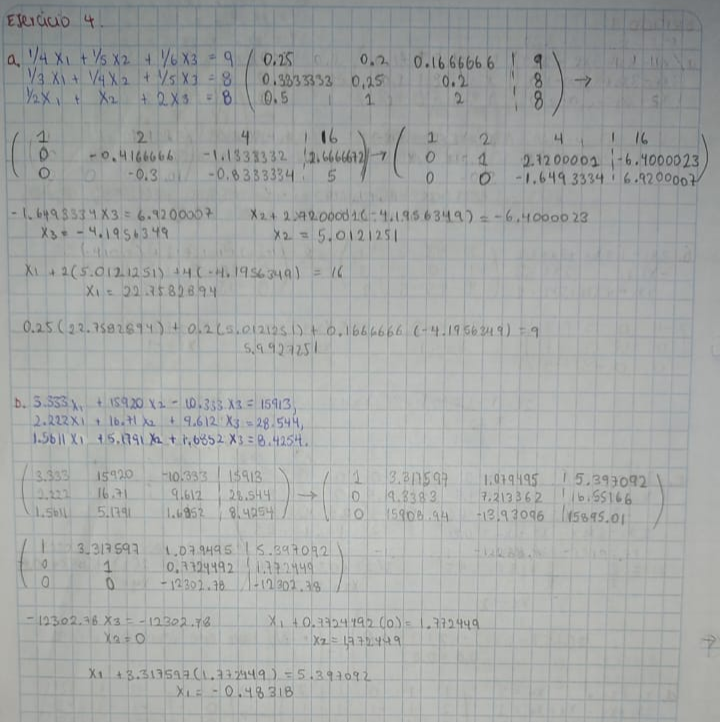
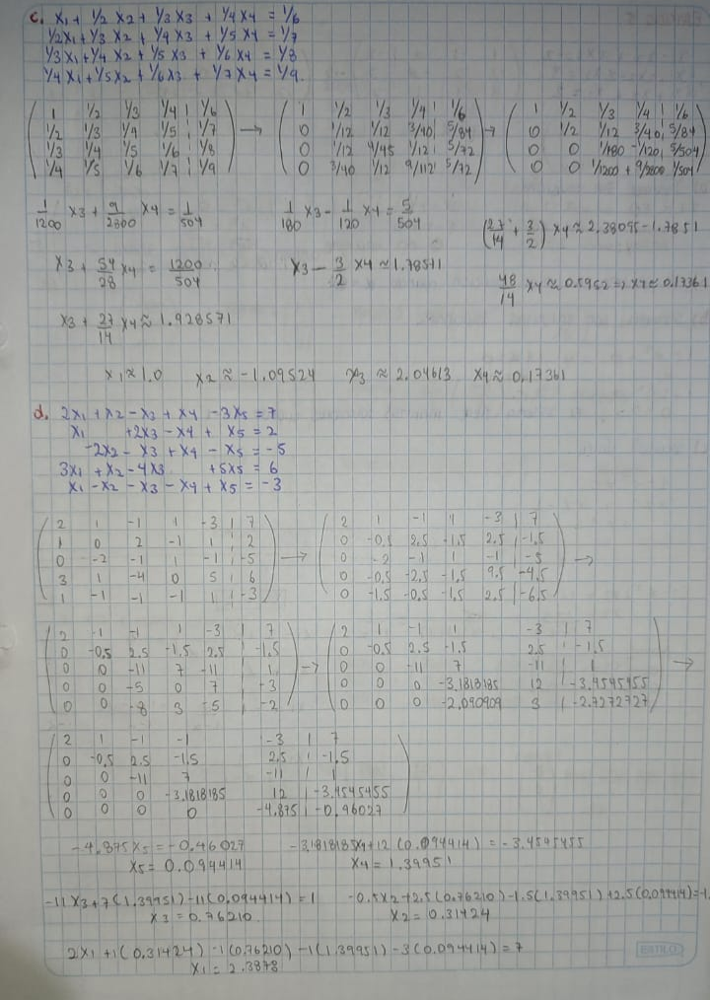
---
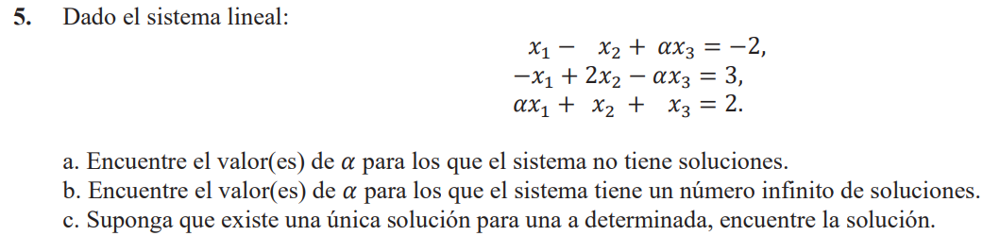
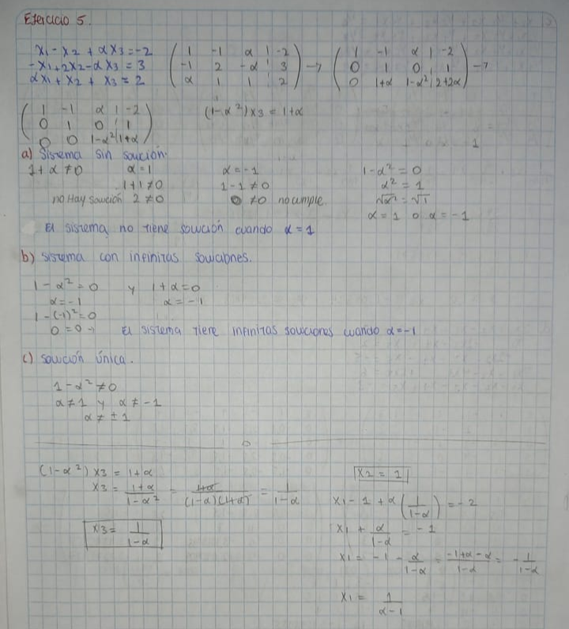
## EJERCICIOS APLICADOS

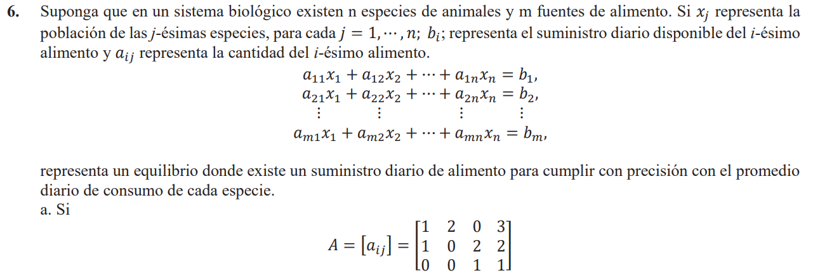
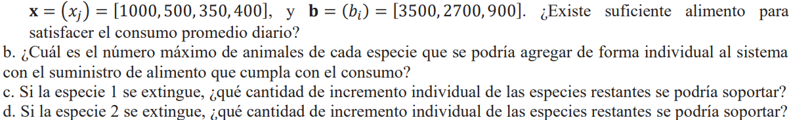
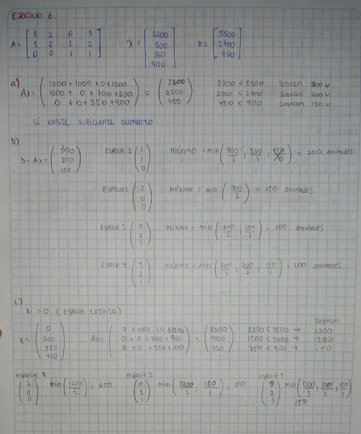
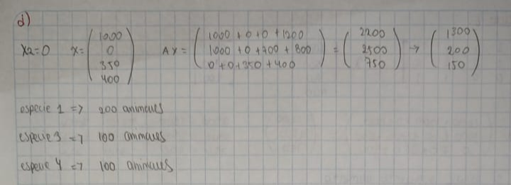
---

## EJERCICIOS TEÓRICOS

7. Repita el ejercicio 4 con el método Gauss-Jordan

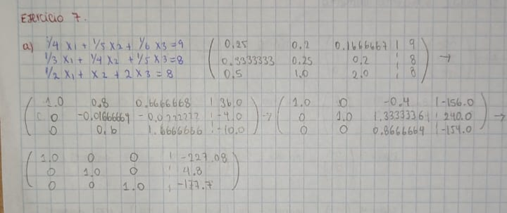