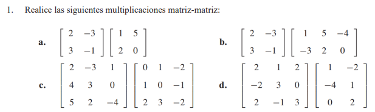
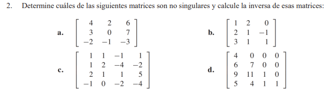
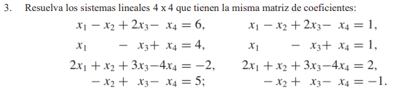
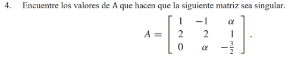
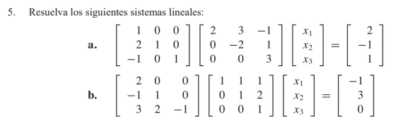
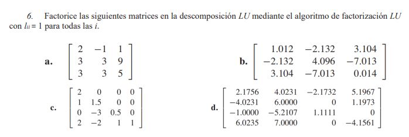
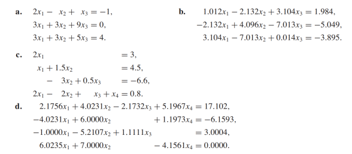

# [Tarea 10] Ejercicios Unidad 04-C | Descomposición LU

## CONJUNTO DE EJERCICIOS

---

---

---

---

---

---
7. Modifique el algoritmo de eliminación gaussiana de tal forma que se pueda utilizar para resolver un sistema
lineal usando la descomposición LU y, a continuación, resuelva los siguientes sistemas lineales.

