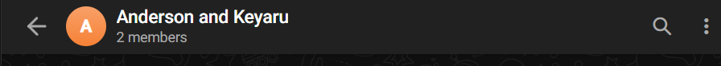

# Actividad Extracurricular de Logging en Telegram

- [Repositorio](https://github.com/keyaru18/DeberesMetodos.git)

El logging ayuda a mantener un registro detallado de lo que hace tu programa, facilitando a la detección de problemas y el monitoreo del funcionamiento.

## Cree un ejemplo que: realice logging en consola, en un archivo, en un mensaje de Telegram. 

1. Crear un bot en telegram en el chat de @BotFather 


2. Crear un grupo de telegram donde se le añada al bot creado.


3. Crear un script en python para recibir el id del chat donde se coloca el url y el token que se recibió al crear el bot.

Antes de ejecutar hay que instalar 
```bash
pip install requests
```

```python
import requests

TOKEN = '7782114763:AAG95EeBfC6Wd7rSEa88cidvMCTX9lkBQUE'
URL = f'https://api.telegram.org/bot{TOKEN}/getUpdates'
response = requests.get(URL)
print(response.json())
```

4. Crear un archivo .py donde:

- Consola: Muestra logs de nivel INFO y superior
- Archivo app.log: Guarda todos los logs (DEBUG y superior)
- Telegram: Envía logs de nivel WARNING y superior al grupo


```python
import logging
import requests

# ================== CONFIGURACIÓN ==================
TELEGRAM_BOT_TOKEN = "7782114763:AAG95EeBfC6Wd7rSEa88cidvMCTX9lkBQUE"
TELEGRAM_CHAT_ID = "-4813543477"  # ID del grupo (negativo)

# ================== HANDLER PARA TELEGRAM ==================
class TelegramHandler(logging.Handler):
    def emit(self, record):
        msg = self.format(record)
        # Limitar a 4000 caracteres para evitar errores
        if len(msg) > 4000:
            msg = msg[:4000] + "..."
        
        # URL correcta
        url = f"https://api.telegram.org/bot{TELEGRAM_BOT_TOKEN}/sendMessage"
        data = {
            'chat_id': TELEGRAM_CHAT_ID,
            'text': f"LOG: {msg}",
            'parse_mode': 'HTML'
        }
        try:
            response = requests.post(url, data=data, timeout=10)
            if response.status_code != 200:
                print(f"Error Telegram: {response.status_code} - {response.text}")
        except Exception as e:
            print(f"Error enviar Telegram: {e}")

# ================== CONFIGURACIÓN DEL LOGGER ==================
def setup_logger():
    logger = logging.getLogger()
    logger.setLevel(logging.DEBUG)
    
    formatter = logging.Formatter(
        '%(asctime)s - %(levelname)s - %(message)s',
        datefmt='%Y-%m-%d %H:%M:%S'
    )
    
    # Handler para consola (INFO+)
    console_handler = logging.StreamHandler()
    console_handler.setLevel(logging.INFO)
    console_handler.setFormatter(formatter)
    
    # Handler para archivo (DEBUG+)
    file_handler = logging.FileHandler('app.log')
    file_handler.setLevel(logging.DEBUG)
    file_handler.setFormatter(formatter)
    
    # Handler para Telegram (WARNING+)
    telegram_handler = TelegramHandler()
    telegram_handler.setLevel(logging.WARNING)
    telegram_handler.setFormatter(formatter)
    
    # Añadir handlers al logger
    logger.addHandler(console_handler)
    logger.addHandler(file_handler)
    logger.addHandler(telegram_handler)
    
    return logger

# ================== EJECUCIÓN ==================
if __name__ == "__main__":
    logger = setup_logger()
    
    # Logs normales
    logger.info("Iniciando aplicación...")
    logger.warning("¡Prueba de Telegram!")  # Se envía a Telegram
    
    # Log de excepción
    try:
        1/0  # Forzar error
    except Exception as e:
        logger.exception("Ocurrió una excepción")  # Se envía a Telegram
    
    logger.info("Pruebas completadas")
```

5. Resultado


## Modifique el logging para mostrar el nombre del archivo, incluir la fecha y la hora, cambiar de color, etc.

- Muestra del nombre del archivo y línea
- Colores en la consola
- Formato de fecha/hora personalizable
- Logueo a archivo con rotación

Antes de ejecutar hay que instalar 
```bash
pip install colorama
```
```python 
import logging
import requests
from colorama import init, Fore, Style
from logging.handlers import RotatingFileHandler

# Inicializar colorama
init()

# ================== CONFIGURACIÓN ==================
TELEGRAM_BOT_TOKEN = "7782114763:AAG95EeBfC6Wd7rSEa88cidvMCTX9lkBQUE"
TELEGRAM_CHAT_ID = "-1002513850512"  # Grupo de Telegram

# ================== HANDLER PARA TELEGRAM ==================
class TelegramHandler(logging.Handler):
    def emit(self, record):
        msg = self.format(record)
        if len(msg) > 4000:
            msg = msg[:4000] + "..."

        url = f"https://api.telegram.org/bot {TELEGRAM_BOT_TOKEN}/sendMessage"
        data = {
            'chat_id': TELEGRAM_CHAT_ID,
            'text': f"🚨 LOG: {msg}",
            'parse_mode': 'HTML'
        }
        try:
            response = requests.post(url, data=data, timeout=10)
            if response.status_code != 200:
                print(f"Error Telegram: {response.status_code} - {response.text}")
        except Exception as e:
            print(f"Error al enviar a Telegram: {e}")

# ================== FORMATO COLOREADO ==================
class ColoredFormatter(logging.Formatter):
    COLORS = {
        logging.DEBUG: Fore.CYAN,
        logging.INFO: Fore.GREEN,
        logging.WARNING: Fore.YELLOW,
        logging.ERROR: Fore.RED,
        logging.CRITICAL: Fore.RED + Style.BRIGHT
    }

    def format(self, record):
        message = super().format(record)
        color = self.COLORS.get(record.levelno, Fore.WHITE)
        return f"{color}{message}{Style.RESET_ALL}"

# ================== CONFIGURACIÓN DEL LOGGER ==================
def setup_logger():
    logger = logging.getLogger()
    logger.setLevel(logging.DEBUG)

    # Formato con detalles
    detailed_format = '%(asctime)s | %(filename)s:%(lineno)d | %(funcName)s | %(levelname)s | %(message)s'
    date_format = '%Y-%m-%d %H:%M:%S'

    # Formato coloreado para consola
    console_formatter = ColoredFormatter(detailed_format, datefmt=date_format)

    # Formato plano para archivo y Telegram
    plain_formatter = logging.Formatter(detailed_format, datefmt=date_format)

    # Handler para consola
    console_handler = logging.StreamHandler()
    console_handler.setLevel(logging.INFO)
    console_handler.setFormatter(console_formatter)

    # Handler para archivo (rotación)
    file_handler = RotatingFileHandler(
        'app.log',
        maxBytes=1_000_000,  # 1MB
        backupCount=5,
        encoding='utf-8'
    )
    file_handler.setLevel(logging.DEBUG)
    file_handler.setFormatter(plain_formatter)

    # Handler para Telegram
    telegram_handler = TelegramHandler()
    telegram_handler.setLevel(logging.WARNING)
    telegram_handler.setFormatter(plain_formatter)

    # Limpiar handlers previos
    logger.handlers.clear()

    # Añadir handlers
    logger.addHandler(console_handler)
    logger.addHandler(file_handler)
    logger.addHandler(telegram_handler)

    return logger

# ================== EJECUCIÓN ==================
if __name__ == "__main__":
    logger = setup_logger()

    logger.info("Iniciando aplicación...")
    logger.warning("¡Prueba de Telegram!")  # Este se envía a Telegram

    try:
        1 / 0  # Forzar error
    except Exception as e:
        logger.exception("Ocurrió una excepción")

    logger.info("Pruebas completadas")
```
- ANTES


- AHORA


